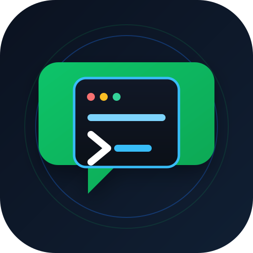

# wechat-codex-bridge

<p align="center">
  
</p>

把**个人微信号**接到本机 Codex CLI：微信里发消息，交给 `codex exec` 执行，再把结果回发到微信。

本项目已从 Wechaty + `wechaty-puppet-wechat4u`（Web 协议）切换到腾讯官方个人微信 Bot 的 iLink 协议。原方案会在 `webwxinit` 时出现：

```text
Wechaty error: AssertionError [ERR_ASSERTION]: 1 == 0
    at Object.equal .../wechat4u/lib/util/global.js:69:24
```

这通常表示微信服务端拒绝了 Web 协议登录（常见 `ret 1203` / 登录环境异常），不是本项目代码问题，继续修补 `wechat4u` 意义不大。iLink 协议是腾讯官方面向个人号 Bot 的接口，当前支持 **私聊消息和媒体，不支持群聊**。

## 最近更新

- 支持配置 Codex 沙盒模式与网络访问能力。
- 支持按用户加载/继续历史 Codex 会话。
- 每条提问包含问题内容的确认消息，并按消息 ID 去重。
- 增加单实例锁，防止多个进程同时回复。
- 支持 Windows 前台运行与登录自动启动任务。
- 默认工作目录改为跨平台的项目目录 `.`，并修复 Windows 白名单路径判断。
- `autoApprove` 改用当前 Codex CLI 的 `--approve-for-me`。
- 不同用户消息可并发处理，同一用户仍按顺序排队。
- 首次登录和重新登录支持 `ILINK_BASE_URL`，发送消息统一检查 `ret`/`errcode`。
- 新增 Python 后端 `handler.py`、任务包管理器和 `manager.py` 交互式 CLI。
- 任务包支持 settings / sessions / workdir / control 四类扩展。
- 增加心跳看门狗模式，心跳会刷新 Codex 超时计时。
- 支持 `/heartbeat`、`/pause`、`/continue`、`/stop` 等控制命令。
- `/pause` 期间静默进度，但内部继续刷新超时，并缓冲最终回复。
- 修复确认消息中工作目录与会话名称读取错误。
- 会话任务包支持 `/rename` 重命名。

## 设计原则

- **工作目录可指定**：`config.json` 设默认值，`.` 表示项目目录；微信会话内可用 `/cd <目录>` 切换。
- **模型继承当前配置**：桥接不传 `-m`，Codex 仍使用 `~/.codex/config.toml` 里的模型。
- **沙盒与网络可配置**：`config.json` 的 `sandboxMode` 和 `networkAccess` 决定 Codex 执行命令时的沙盒及网络策略。
- `--skip-git-repo-check` 只放宽「必须是 git 仓库」这一条，不改变模型。
- 默认 `autoApprove: false`。开启时只对新建会话传入 `--approve-for-me`；`codex exec resume` 不提供该参数。
- 每条提问会先回一条包含问题内容的确认消息，并按微信消息 ID 去重，确保同一提问不会在 Codex 中重复运行。

## 依赖

- Node.js 22+（使用全局 `fetch`）
- npm 10+（本项目使用 lockfileVersion 3）
- 已安装 `codex` 命令且 `codex exec` 可用；验证环境为 Codex CLI 0.151.0
- `~/.codex/config.toml` 已配置模型（本机当前为 `deepseek-v4-pro`）

安装项目依赖：

```bash
cd wechat-codex-bridge
npm ci
```

运行时 npm 依赖为 `cross-spawn` 和 `qrcode-terminal`，版本已记录在 `package-lock.json`。

## 配置

编辑 `config.json`：

| 键 | 含义 | 默认 |
|---|---|---|
| `backend` | 处理后端：`python` 或 `node` | `python` |
| `workdir` | 默认工作目录，`.` 表示项目目录 | `.` |
| `allowedWorkdirs` | 工作目录白名单，空数组表示不限制 | `[]` |
| `autoApprove` | `true` 时对新建 Codex 会话传 `--approve-for-me`。默认关闭，遵循当前配置 | `false` |
| `skipGitRepoCheck` | 允许在非 git 目录运行 | `true` |
| `sandboxMode` | Codex 沙盒模式：`read-only`、`workspace-write`、`danger-full-access` | `workspace-write` |
| `networkAccess` | `true` 时允许 workspace-write 沙盒访问网络 | `true` |
| `pythonPreprocess` | 可选：发送给 Codex 前调用的 Python 脚本路径 | `""` |
| `pythonPostprocess` | 可选：Codex 返回后调用的 Python 脚本路径 | `""` |
| `pythonHandler` | `backend=python` 时使用的 Python 处理脚本 | `handler.py` |
| `pythonHandlerTimeoutMs` | `pythonHandler` 的超时时间（毫秒） | `1800000` |
| `progressReplies` | `true` 时在 Codex 运行期间定期发送进度消息 | `true` |
| `progressIntervalMs` | 进度消息发送间隔（毫秒） | `600000` |
| `replyMaxLength` | 单条微信回复最大字符数，超出分段发送 | `4000` |
| `whitelist` | 允许使用机器人的 `from_user_id`，空数组表示不限制 | `[]` |

模型仍直接继承 `~/.codex/config.toml`；沙盒和网络策略由上方 `sandboxMode`、`networkAccess` 控制。

完整示例：

```json
{
  "backend": "python",
  "workdir": ".",
  "allowedWorkdirs": [],
  "autoApprove": false,
  "skipGitRepoCheck": true,
  "sandboxMode": "workspace-write",
  "networkAccess": true,
  "pythonPreprocess": "",
  "pythonPostprocess": "",
  "pythonHandler": "handler.py",
  "pythonHandlerTimeoutMs": 1800000,
  "progressReplies": true,
  "progressIntervalMs": 600000,
  "replyMaxLength": 4000,
  "whitelist": [
    "你的微信 userId"
  ]
}
```

`allowedWorkdirs` 为空时表示不限制工作目录；填写后 `/cd` 只能切换到列表内目录或其子目录。

开启 `progressReplies` 后，桥接会在 Codex 执行期间按 `progressIntervalMs` 定期回复类似：

```text
Codex 仍在处理中，已运行 600 秒
当前阶段：正在调用 Codex
```

这只用于避免用户长时间看不到反馈，不会改变 Codex 本身的执行或超时机制。

进度消息会读取 Codex 自身产生的 JSONL 事件，尽量显示实际生成内容或工具调用状态，例如：

```text
当前阶段：正在生成回答：分析完成后，建议将代码拆分为三个模块...
当前阶段：正在调用工具：shell
```

### Python 信息处理钩子

桥接支持在消息进入 Codex 前、以及 Codex 返回后调用 Python 脚本处理信息：

- `pythonPreprocess`：从 stdin 读取原始微信消息，把处理后的 prompt 写到 stdout。
- `pythonPostprocess`：从 stdin 读取 Codex 返回文本，把处理后的回复写到 stdout。

示例 `preprocess.py`：

```python
import sys

text = sys.stdin.read()
print(f"请分析以下内容并给出结论：\n{text}")
```

配置：

```json
{
  "pythonPreprocess": "hooks/preprocess.py",
  "pythonPostprocess": "hooks/postprocess.py"
}
```

脚本路径相对当前用户的工作目录解析；脚本执行超时时间为 60 秒。

### 完全由 Python 调用 Codex

如果配置了 `pythonHandler`，普通微信消息会直接交给该 Python 脚本处理：

```json
{
  "pythonHandler": "handler.py"
}
```

处理流程：

```text
微信消息 -> Node 桥接读取 stdin -> python handler.py -> 调用 codex -> stdout -> 微信回复
```

`handler.py` 示例：

```python
import os
import subprocess
import sys

message = sys.stdin.read()
workdir = os.environ.get("CODEX_BRIDGE_WORKDIR", os.getcwd())

result = subprocess.run(
    [
        "codex", "exec",
        "--json", "--color", "never",
        "-C", workdir,
        "--skip-git-repo-check",
        "--", message,
    ],
    capture_output=True,
    text=True,
    timeout=1800,
)

# 这里可按需解析 stdout，或直接输出最后一行文本。
print(result.stdout.strip())
```

桥接会设置以下环境变量供 Python 使用：

- `CODEX_BRIDGE_WORKDIR`：当前用户的工作目录。
- `CODEX_BRIDGE_USER_ID`：当前微信用户 ID。

路径写法随系统不同：Windows 使用 `D:/code/project` 这类绝对路径，Linux/macOS 使用 `/home/you/project`。`workdir` 设为 `.` 时，项目实际目录由进程工作目录决定，Windows 和 Linux 都不需要为默认值改写平台路径。

### 本地 manager.py

在后台服务离线时，可以用 `manager.py` 部署、运行和管理任务包：

```bash
python3 manager.py deploy
python3 manager.py run-once '/help'
python3 manager.py run-once '只回复两个字：测试'
python3 manager.py package list
```

如果后台服务仍在运行，`manager.py` 会拒绝执行，避免与微信桥接进程同时操作 Codex。

### manager.py 交互菜单与后台服务控制

直接运行 `manager.py` 会进入交互式菜单：

```bash
python3 manager.py menu
```

交互菜单会根据后台服务状态动态显示“开启/关闭后台服务”选项。进入菜单时若检测到服务正在运行，会先询问是否关闭服务；退出菜单时若服务未运行，会询问是否重新开启服务。

选择“运行一次 handler”后会进入命令子菜单，列出所有已启用任务包中的命令、用法和说明。用户只需要选择命令，再输入该命令后面的参数，无需手动输入 `/` 命令前缀。

选择具体命令后，会先调用该任务包内的 `help(command)` 方法显示具体用法，再提示输入参数。运行结果不再显示原始 JSON，而是按“结果/错误/附件”友好展示。

主菜单现在包含四个子菜单：

```text
1. 运行一次 handler
2. 任务包管理
3. 后台服务管理
4. 项目安装/卸载
```

- 任务包管理：列出、添加、删除、启用、禁用、调整顺序。
- 后台服务管理：查看状态、启动、停止、重启、开启/关闭自启。
- 项目安装/卸载：按顺序提供“安装依赖 → 首次登录 → 部署任务包 → 迁移状态 → 安装/卸载后台服务 → 清理状态”。

## 通过 manager.py 完成部署与运行

下面是从零开始，用 `manager.py` 部署并运行项目的完整流程。

### 1. 准备环境

确认已安装：

```bash
python3 --version
node --version
npm --version
codex exec --help
```

进入项目目录：

```bash
cd /home/jianing/data/wechat-codex-bridge
```

### 2. 安装依赖

可以进入交互菜单：

```bash
python3 manager.py
```

然后选择：

```text
4. 项目安装/卸载
1. 安装项目依赖
```

也可以直接运行：

```bash
npm ci
```

如果本机没有 `package-lock.json`，使用：

```bash
npm install
```

### 3. 首次登录并获取微信 token

后台服务需要先离线登录一次，生成 `state/auth.json`：

命令行：

```bash
python3 manager.py login
```

交互菜单：

```text
4. 项目安装/卸载
2. 首次扫码登录微信
```

也可以直接运行：

```bash
npm start
```

终端会显示二维码，用手机微信扫码确认。看到“登录成功”后按 `Ctrl-C` 退出。


### 4. 部署并注册内置任务包

命令行：

```bash
python3 manager.py deploy
```

或交互菜单：

```text
4. 项目安装/卸载
3. 部署并注册内置任务包
```

这一步会注册：

```text
packages/settings
packages/sessions
packages/workdir
```

### 5. 迁移旧状态

如果之前使用过 Node 版本，可以执行：

```bash
python3 manager.py migrate-state
```

交互菜单：

```text
4. 项目安装/卸载
4. 迁移 Node 状态
```

该命令会把旧的 `state/codex-sessions.json` 迁移到：

```text
packages/sessions/state.json
```

### 6. 安装后台服务

命令行：

```bash
sudo bash deploy/install-service.sh
```

或交互菜单：

```text
4. 项目安装/卸载
5. 安装后台服务
```

安装完成后，`manager.py` 会自动停止刚启动的后台服务，避免与本地管理操作冲突。

### 7. 启动后台服务

交互菜单：

```text
3. 后台服务管理
2. 启动后台服务
```

命令行：

```bash
python3 manager.py service start
```

查看状态：

```bash
python3 manager.py service status
tail -f logs/bridge.log
```

### 8. 本地验证

先确保后台服务已停止：

```bash
python3 manager.py service stop
```

然后本地运行：

```bash
python3 manager.py run-once '/help'
python3 manager.py run-once '只回复两个字：测试'
```

或者进入交互菜单：

```bash
python3 manager.py menu
```

选择：

```text
1. 运行一次 handler
```

在子菜单中选择命令并输入参数。

### 9. 管理任务包

```bash
python3 manager.py package list
python3 manager.py package add packages/新任务包
python3 manager.py package enable <包ID>
python3 manager.py package disable <包ID>
python3 manager.py package order <包ID> <序号>
```

或使用交互菜单：

```text
2. 任务包管理
```

### 10. 卸载后台服务

交互菜单：

```text
4. 项目安装/卸载
6. 卸载后台服务
```

该操作会停止服务、取消开机自启，并删除 systemd 服务文件。

如果还想清理本地运行状态，可继续选择：

```text
4. 项目安装/卸载
7. 清理运行状态
```

也可以通过命令行直接控制后台服务：

```bash
python3 manager.py service status
python3 manager.py service start
python3 manager.py service stop
python3 manager.py service restart
python3 manager.py service enable
python3 manager.py service disable
```

说明：

- `service enable`：设置后台服务开机自启。
- `service disable`：关闭后台服务开机自启。
- Linux 下会优先使用 systemd；Windows 下会尝试使用计划任务。
- 如果检测不到 systemd / 计划任务，`start` 会提示手动运行 `npm start`。

## 运行

首次运行会通过终端二维码登录个人微信号：

```bash
npm start
```

流程：

1. 向 `https://ilinkai.weixin.qq.com` 获取机器人二维码。
2. 用手机微信扫码确认；如服务器要求配对数字，按提示输入。
3. 登录成功后，token 与接入节点保存在 `state/auth.json`，长轮询 cursor 保存在 `state/sync.json`。
4. 微信里给机器人发消息即可触发 Codex。

也可以通过环境变量跳过二维码登录：

```bash
ILINK_BOT_TOKEN=你的token \
ILINK_BASE_URL=你的baseUrl \
npm start
```

支持的环境变量：

| 变量 | 含义 | 必填 |
|---|---|---|
| `ILINK_BOT_TOKEN` | iLink bot token | 否，已有 `state/auth.json` 时可省略 |
| `ILINK_BASE_URL` | iLink API 地址，也用于首次扫码登录 | 否，默认 `https://ilinkai.weixin.qq.com` |
| `ILINK_BOT_ID` | bot/account ID | 否 |
| `ILINK_USER_ID` | 扫码绑定用户的 userId | 否 |
| `CODEX_WECHAT_DEBUG` | 非空时打印 Codex 进度调试日志 | 否 |

运行状态文件：

```text
state/auth.json             登录 token、账号和接入节点
state/sync.json             微信长轮询游标
state/context-tokens.json   每个用户的 context_token
state/codex-sessions.json   每个用户当前绑定的 Codex 会话
state/seen-messages.json    已处理消息 ID（用于去重）
state/bridge.lock           单实例锁
```

机器人命令：

```text
/cd <目录>   设置当前用户的工作目录（绝对路径，或相对默认 workdir）
/workdir     查看当前工作目录
/history [n] 列出最近的 Codex 会话
/resume <会话ID|last> 加载指定历史会话
/session     查看当前会话
/rename <名称> 重命名当前会话
/new         开始新会话
/help        帮助
```

普通消息会沿用当前用户上一次的 Codex 会话；首次消息会创建新会话。用 `/history` 找到会话 ID 后，可用 `/resume <会话ID>` 明确加载某个历史会话。

## 协议说明

实现依据腾讯官方个人微信 Bot 插件 `@tencent-weixin/openclaw-weixin`：

- npm：`@tencent-weixin/openclaw-weixin`
- 文档：`https://docs2.openclaw.ai/zh-CN/channels/wechat`
- 源码：`https://github.com/Tencent/openclaw-weixin`

关键点：

- 固定登录域名：`https://ilinkai.weixin.qq.com`
- 登录：`POST ilink/bot/get_bot_qrcode?bot_type=3`，再长轮询 `GET ilink/bot/get_qrcode_status`
- 消息：`POST ilink/bot/getupdates` 长轮询，`POST ilink/bot/sendmessage` 回复
- 回复时必须带当前来消息里的 `context_token`
- token 有效期约 24 小时；失效后需重新扫码，每次扫码 Bot ID 可能变化
- 当前官方能力为私聊和媒体，不支持群聊

## 安全注意事项

- 保持 `autoApprove: false`，避免自动绕过审批。开启后只使用 `--approve-for-me`，且只作用于新建会话。
- 在 `config.json` 中根据需求设置 `sandboxMode` 和 `networkAccess`；不要把工作目录设为敏感目录。
- 用 `whitelist` 限制谁能触发机器人。iLink 场景中填入登录后日志里的 `userId`。
- 当 `whitelist` 为空时，服务启动会打印安全警告；正式使用前建议填写 `userId`。
- `state/` 已加入 `.gitignore`，不要把 token 或 `~/.codex/config.toml` 的 API key 提交到仓库。
- 个人号扫码登录存在风控/封号风险，请使用小号或测试号。

## 测试

```bash
npm test
```

测试覆盖 Codex 调用封装与 iLink 纯函数（二维码、文本解析、消息过滤）。

## 后台运行与开机自启

项目已包含 systemd 服务文件 [wechat-codex-bridge.service](/home/jianing/data/wechat-codex-bridge/deploy/wechat-codex-bridge.service) 和安装脚本。

首次仍建议先在终端前台登录一次，完成扫码并让 token 写入 `state/auth.json`：

```bash
cd /home/jianing/data/wechat-codex-bridge
npm start
```

看到“登录成功”后按 `Ctrl-C` 退出，然后安装服务：

```bash
sudo bash deploy/install-service.sh
```

之后服务会随系统启动，并在异常退出后自动重启。常用命令：

```bash
systemctl status wechat-codex-bridge
sudo systemctl restart wechat-codex-bridge
sudo systemctl stop wechat-codex-bridge
tail -f logs/bridge.log
```

服务文件里的用户名、项目路径、Node 路径如与实际环境不同，请先修改 `deploy/wechat-codex-bridge.service`。

## Windows 运行方式

Windows 上没有 systemd，推荐用 Windows 任务计划程序实现登录后自动启动，并配合脚本运行。

前置条件：

- 安装 Node.js 22+ 和 Codex CLI。
- 确保 `codex`、`node` 命令在 PowerShell / CMD 中可用。

首次前台登录：

```powershell
cd C:\path\to\wechat-codex-bridge
npm ci
npm start
```

手机微信扫码成功并看到“登录成功”后，按 `Ctrl-C` 退出。

前台运行脚本：

```bat
start-windows.bat
```

安装登录自动启动任务：

```powershell
powershell -ExecutionPolicy Bypass -File .\install-windows-service.ps1
```

移除任务：

```powershell
powershell -ExecutionPolicy Bypass -File .\uninstall-windows-service.ps1
```

手动启动任务：

```powershell
Start-ScheduledTask -TaskName wechat-codex-bridge
```

查看状态：

```powershell
Get-ScheduledTask -TaskName wechat-codex-bridge
Get-ScheduledTaskInfo -TaskName wechat-codex-bridge
```

代码已使用 `cross-spawn` 兼容 Windows 下的 `codex.cmd` 启动；路径处理使用 Node 的 `path` 模块，工作目录、状态文件在 Windows 下同样可用。

## 常见问题

### 扫码后提示 AssertionError: 1 == 0

这是旧 Wechaty Web 协议被微信拒绝登录导致的。本项目已切换到 iLink 协议，请勿再使用 `WECHATY_PUPPET=wechaty-puppet-wechat4u` 启动。

### 日志中出现 already has an active writer

说明同一个 Codex 会话正在被另一个 Codex 进程写入。桥接会自动改用新会话并回复提示；如果必须继续该历史会话，请先关闭占用它的 Codex 进程。

### 看起来有多个机器人回复

通常是因为同时运行了多个 `node index.mjs` 实例。项目已加入单实例锁；先关闭旧进程，再只启动一个实例。

### token 失效 / 重新登录

iLink token 约 24 小时有效。服务检测到 `errcode -14` 会自动重新发起二维码登录。若后台服务无法直接扫码，可先 `sudo systemctl stop wechat-codex-bridge`，在终端执行 `npm start` 完成登录，再重新启动服务。
